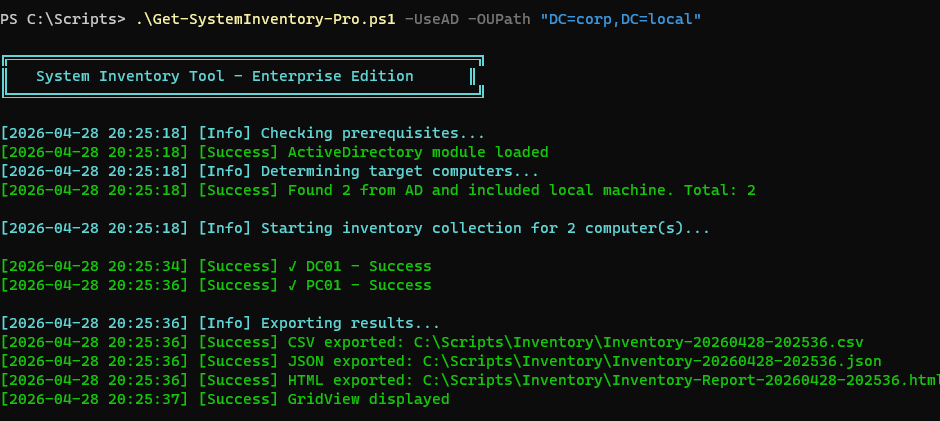
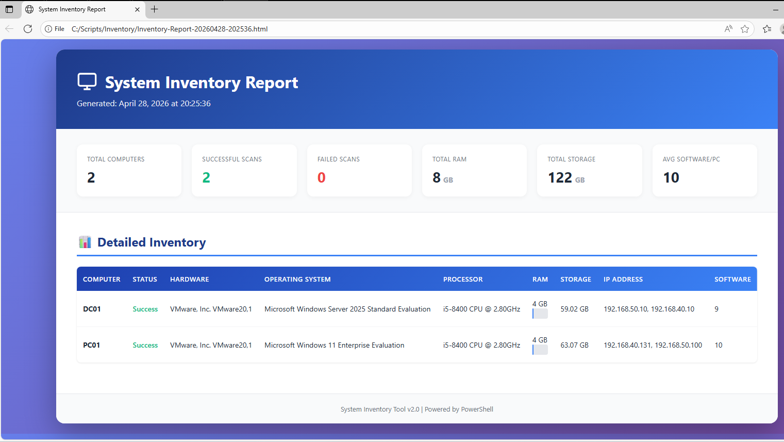
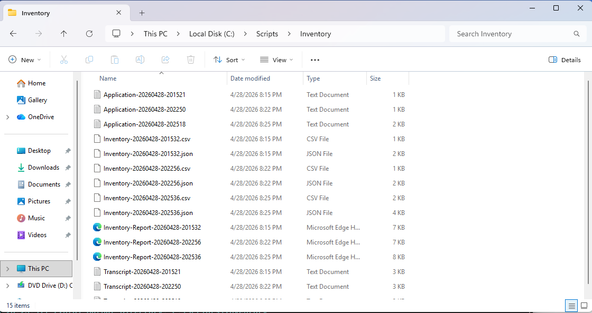

# Get-SystemInventory-Pro

> **PowerShell portfolio tool for collecting hardware, software, and network inventory from local and remote Windows machines.**

---

## Table of Contents

- [Overview](#overview)
- [Features](#features)
- [Requirements](#requirements)
- [Installation](#installation)
- [Quick Start](#quick-start)
- [Parameters](#parameters)
- [Usage Examples](#usage-examples)
- [Output](#output)
- [Data Collected](#data-collected)
- [Architecture](#architecture)
- [Troubleshooting](#troubleshooting)
- [FAQ](#faq)
- [License](#license)

---

## Overview

`Get-SystemInventory-Pro.ps1` is a lab/portfolio script for practising Windows asset inventory. It supports local and remote targeting, AD OU queries, optional parallel collection, and multiple report formats. Production readiness, scale, and remote compatibility require separate validation in the intended environment.

```
╔════════════════════════════════════════════════════╗
║   System Inventory Tool - Enterprise Edition       ║
╚════════════════════════════════════════════════════╝
```

---

## Features

| Category | Capability |
|---|---|
| **Targeting** | Local machine, explicit host list, AD OU query |
| **Connectivity** | Ping + WinRM pre-flight checks per host |
| **Data collection** | Hardware, OS, CPU, RAM, disk, network, installed software, CPU load |
| **Parallel mode** | `ForEach-Object -Parallel` with configurable throttle (PS 7+) |
| **Export formats** | CSV, JSON, styled HTML report, interactive GridView |
| **Logging** | Color-coded console output + timestamped application log + PowerShell transcript |
| **Error handling** | Per-host fault isolation — one failure never stops the batch |
| **AD integration** | Recursive OU search via `Get-ADComputer` |

---

## Requirements

### Mandatory

| Requirement | Minimum Version |
|---|---|
| PowerShell | **5.1** (Windows PowerShell) |
| Operating System | Windows 10 / Server 2016 or later |
| Permissions | Local Admin on target machines |

### Optional

| Requirement | Needed For |
|---|---|
| **PowerShell 7+** | `-Parallel` flag |
| **RSAT ActiveDirectory module** | `-UseAD` / `-OUPath` flags |
| **WinRM enabled on targets** | Any remote inventory |

#### Install RSAT AD Module (if needed)

```powershell
# Windows Server
Install-WindowsFeature RSAT-AD-PowerShell

# Windows 10/11
Add-WindowsCapability -Online -Name Rsat.ActiveDirectory.DS-LDS.Tools~~~~0.0.1.0
```

#### Enable WinRM on remote targets

```powershell
# Run on each target (or via GPO)
Enable-PSRemoting -Force
```

---

## Installation

```bash
git clone https://github.com/SuriyaBoon/home-lab-v5.git
cd home-lab-v5
```

Or download the script directly:

```powershell
Invoke-WebRequest -Uri "https://raw.githubusercontent.com/SuriyaBoon/home-lab-v5/main/Get-SystemInventory-Pro.ps1" `
                  -OutFile "Get-SystemInventory-Pro.ps1"
```

> **Execution Policy** — If scripts are blocked, run:
> ```powershell
> Set-ExecutionPolicy -Scope CurrentUser -ExecutionPolicy RemoteSigned
> ```

---

## Quick Start

```powershell
# Scan the local machine with all export formats
.\Get-SystemInventory-Pro.ps1

# Scan multiple remote machines
.\Get-SystemInventory-Pro.ps1 -ComputerName PC01, PC02, PC03

# Scan an entire Active Directory OU
.\Get-SystemInventory-Pro.ps1 -OUPath "OU=Workstations,DC=company,DC=local"
```

---

## Parameters

| Parameter | Type | Default | Description |
|---|---|---|---|
| `-ComputerName` | `String[]` | `$env:COMPUTERNAME` | One or more target hostnames or IP addresses |
| `-OUPath` | `String` | *(none)* | Active Directory OU distinguished name to query all computers from |
| `-UseAD` | `Switch` | `$false` | Query all computers from Active Directory (used with `-OUPath`) |
| `-Credential` | `PSCredential` | *(none)* | Alternate credentials for remote WinRM connections |
| `-OutputPath` | `String` | `C:\Scripts\Inventory` | Directory where all report files are saved |
| `-ExportFormat` | `String[]` | `All` | One or more of: `CSV`, `JSON`, `HTML`, `GridView`, `All` |
| `-Parallel` | `Switch` | `$false` | Enable parallel collection (requires PowerShell 7+) |
| `-ThrottleLimit` | `Int` | `10` | Max concurrent jobs when running in parallel mode |

---

## Usage Examples

### 1 — Scan local machine only

```powershell
.\Get-SystemInventory-Pro.ps1
```

### 2 — Scan a list of remote computers

```powershell
.\Get-SystemInventory-Pro.ps1 -ComputerName "WS-001","WS-002","SRV-FILESERVER"
```

### 3 — Scan with alternate credentials

```powershell
$cred = Get-Credential
.\Get-SystemInventory-Pro.ps1 -ComputerName "WS-001" -Credential $cred
```

### 4 — Scan an Active Directory OU (recursive)

```powershell
.\Get-SystemInventory-Pro.ps1 -OUPath "OU=Workstations,OU=IT,DC=company,DC=local"
```

### 5 — Parallel scan with custom output path and CSV only

```powershell
.\Get-SystemInventory-Pro.ps1 `
    -OUPath "OU=Workstations,DC=corp,DC=local" `
    -Parallel `
    -ThrottleLimit 20 `
    -OutputPath "D:\Reports\Q2-Audit" `
    -ExportFormat CSV
```

### 6 — HTML report + GridView for on-screen review

```powershell
.\Get-SystemInventory-Pro.ps1 -ComputerName (Get-Content servers.txt) `
    -ExportFormat HTML, GridView
```

---

## Output

All files are timestamped and written to `-OutputPath` (default: `C:\Scripts\Inventory`).

```
C:\Scripts\Inventory\
├── Inventory-20250101-143022.csv          # Flat CSV for Excel / BI tools
├── Inventory-20250101-143022.json         # Full-depth JSON (depth 10)
├── Inventory-Report-20250101-143022.html  # Styled HTML report (auto-opens)
├── Application-20250101-143022.log        # Timestamped application log
└── Transcript-20250101-143022.txt         # Full PowerShell transcript
```

### HTML Report Preview

The HTML report includes:
- **Summary stat cards** — Total computers, successful scans, failed scans, aggregate RAM, aggregate storage, average software count
- **Detailed table** — Per-host row with hardware, OS, processor, RAM (with visual bar), storage, IP, and software count
- Color-coded status indicators (green = Success, red = Failed)

---

## Data Collected

Each successfully scanned host produces the following fields:

| Category | Fields |
|---|---|
| **Metadata** | ScanDate, ComputerName, Domain, CurrentUser, Status |
| **Hardware** | Manufacturer, Model, SerialNumber, BIOSVersion |
| **Operating System** | OperatingSystem, OSVersion, OSArchitecture, InstallDate, LastBootTime |
| **Processor** | Processor (name), CPUCores, CPULogicalProcessors, CPULoad (%) |
| **Memory** | TotalRAM_GB, FreeRAM_GB |
| **Storage** | TotalStorage_GB, FreeStorage_GB, DiskDetails (per drive) |
| **Network** | IPAddress, MACAddress, NetworkAdapter |
| **Software** | InstalledSoftwareCount |
| **Error** | ErrorMessage (populated on failure) |

> Disk details are formatted as: `C: 476.94GB (210.33GB free); D: 1000.00GB (640.12GB free)`

---

## Architecture

```
Get-SystemInventory-Pro.ps1
│
├── Test-Prerequisites       # Validates AD module & PS version
├── Get-TargetComputers      # Resolves host list (direct or AD OU)
├── Test-ComputerConnectivity # Ping + WinRM pre-flight per host
├── Get-ComputerInventory    # CIM/WMI data collection (local or Invoke-Command)
├── Export-Results           # Dispatches to CSV / JSON / HTML / GridView
└── Get-HTMLReport           # Builds styled self-contained HTML
```

**Execution flow:**

```
Initialize → Prerequisites → Resolve Targets → [Parallel|Sequential] Collect → Export → Summary
```

Failures are caught per-host and logged without halting the pipeline. All unhandled exceptions bubble up to the top-level `try/catch` which logs a critical error before stopping the transcript.

---

## Troubleshooting

### "Access is denied" on remote machines

- Confirm the account running the script has local admin rights on the target.
- Pass explicit credentials with `-Credential (Get-Credential)`.

### "WinRM is not enabled or accessible"

```powershell
# On the target machine (or via GPO)
Enable-PSRemoting -Force
```

Prefer domain authentication to named hosts. Do not use a wildcard TrustedHosts setting as a generic fix; confirm name resolution, permissions, and the intended WinRM authentication configuration.

### `-Parallel` flag is ignored / falls back to sequential

- Parallel mode requires **PowerShell 7+**. Check your version: `$PSVersionTable.PSVersion`.
- Download PowerShell 7: https://aka.ms/powershell

### "Missing required module: ActiveDirectory"

Install RSAT on the machine running the script (not the targets):

```powershell
# Windows 10/11
Add-WindowsCapability -Online -Name Rsat.ActiveDirectory.DS-LDS.Tools~~~~0.0.1.0
```

### Output directory not created

The script auto-creates `-OutputPath`. Ensure the account has write access to the parent directory.

### HTML report does not open automatically

The script calls `Start-Process` on the HTML file. If a browser is not set as the default for `.html`, open the file manually from the output directory.

---

## FAQ

**Can I run this against non-domain machines?**
Yes, use `-ComputerName` with IP addresses or hostnames. Supply `-Credential` for authentication. Ensure WinRM is enabled on the target and the machine is reachable.

**How do I import the CSV into Excel?**
Open Excel → Data → Get Data → From Text/CSV → select the file. The CSV is UTF-8 encoded.

**Does this collect passwords or sensitive data?**
No. The script collects only hardware specs, OS metadata, network configuration, and installed software counts. No software names, user files, or credentials are stored.

**Can I schedule this to run automatically?**
Yes. Create a scheduled task using `schtasks` or Task Scheduler pointing to:
```
powershell.exe -NonInteractive -File "C:\Scripts\Get-SystemInventory-Pro.ps1" -OutputPath "D:\Reports"
```

**How do I add a custom field to the inventory?**
Extend the `[PSCustomObject]` inside `Get-ComputerInventory`'s `$scriptBlock` with any additional CIM/WMI query, then re-run. All export formats will automatically include the new field.

---



